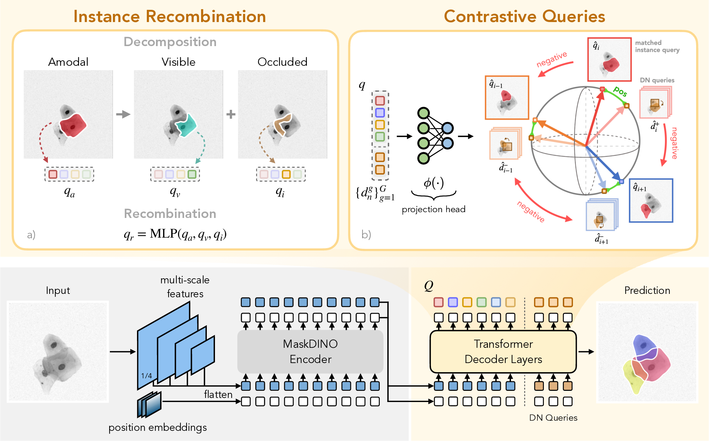
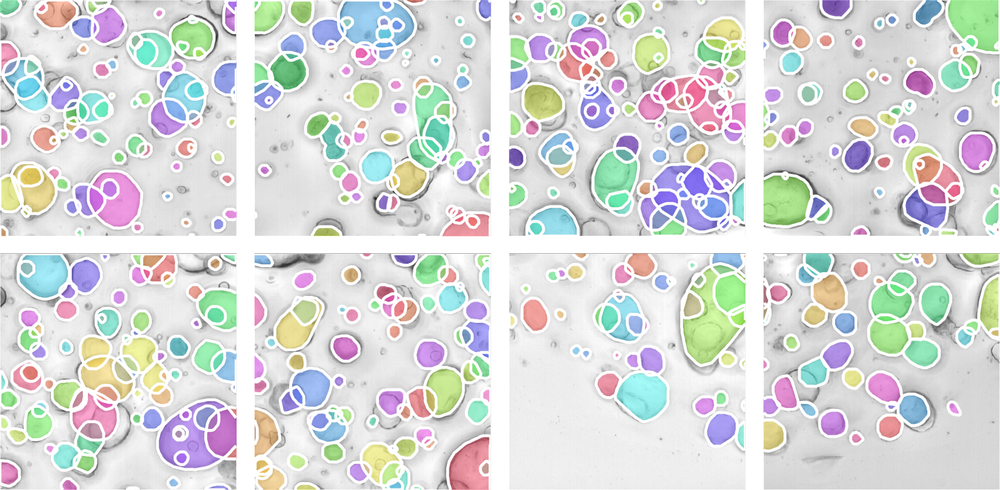

<h1 align="center">QCell: Recombining and Aligning Cell Queries for Overlapping Instance Segmentation</h1>

<div align="center">


[](https://huggingface.co/datasets/YaroslavPrytula/Revvity-25)
[](https://slavkoprytula.github.io/QCell/)

</div>

<div align="center" style="margin-top: 10px; margin-bottom: 20px;">
  <span class="author-block">
    <a href="https://slavkoprytula.github.io/">Yaroslav Prytula</a><sup>1,2</sup>
  </span> &nbsp;|&nbsp;
  <span class="author-block">
    <a href="https://scholar.google.com/citations?user=L5CKTZoAAAAJ&hl=en">Anton Popov</a><sup>2,3</sup>
  </span> &nbsp;|&nbsp;
  <span class="author-block">
    <a href="https://scholar.google.com/citations?user=IOuDrrEAAAAJ&hl=en">Dmytro Fishman</a><sup>1,4,5</sup>
  </span>
  <div class="publication-authors">
    <small>
    <span class="author-block"><sup>1</sup>Institute of Computer Science, University of Tartu, Tartu, Estonia</span><br>
    <span class="author-block"><sup>2</sup>Faculty of Applied Sciences, Ukrainian Catholic University, Lviv, Ukraine</span><br>
    <span class="author-block"><sup>3</sup>Department of Electronic Engineering, Micro- and Biomedical Electronics, Igor Sikorsky Kyiv Polytechnic Institute, Kyiv, Ukraine</span><br>
    <span class="author-block"><sup>4</sup>STACC OÜ, Tartu, Estonia</span><br>
    <span class="author-block"><sup>5</sup>Better Medicine OÜ, Tartu, Estonia</span>
    </small>
  </div>
</div>

<p align="center">
  <br>
  <em><strong>Overview of QCell.</strong> QCell builds on a MaskDINO-style query-based segmentation pipeline, where multi-scale image features and positional embeddings are processed by the encoder and refined by transformer decoder layers with content and DN queries. The proposed modules are shown above: (a) instance recombination decomposes each query into amodal, visible, and occluded sub-representations and recombines them into a refined full-instance query; (b) contrastive query learning uses matched instance queries q&#770;<sub>i</sub> by Hungarian matching as anchors, corresponding DN queries d&#770;<sup>+</sup><sub>i</sub> across all groups as positives and other DN queries as negatives to align queries of the same cell and separate queries of different cells in latent space.</em>
</p>

---

This is the official repository for the paper:

> **QCell: Recombining and Aligning Cell Queries for Overlapping Instance Segmentation**<br>
> Yaroslav Prytula, Anton Popov, Dmytro Fishman<br>
> *British Machine Vision Conference (BMVC), 2026*

---

## Table of Contents

- [Overview](#overview)
- [Installation](#installation)
- [Datasets](#datasets)
  - [Organoids](#organoids)
  - [Revvity-25](#revvity-25)
  - [ISBI 2014](#isbi-2014)
- [Training](#training)
- [Inference and Evaluation](#inference-and-evaluation)
- [License](#license)
- [Citation](#citation)
- [Contact](#contact)
- [Acknowledgments](#acknowledgments)

---

## Overview

Overlapping-cell instance segmentation is challenging because semi-transparent structures create weak boundaries and mixed visual evidence in overlap regions. QCell introduces two complementary components for global reasoning over overlapping objects:

1. **Instance recombination** decomposes each object query into amodal, visible, and occluded sub-representations, then recombines them into a refined full-instance query.
2. **Contrastive query alignment** uses Hungarian-matched instance queries as anchors, corresponding denoising queries as positives, and denoising queries from other cells as negatives.

QCell improves overlapping-cell separation across multiple microscopy benchmarks, including ISBI 2014, Revvity-25, and the new Organoids dataset.

---

## Installation

The development environment uses Python 3.10, PyTorch 2.11, CUDA 12.8, and Detectron2 0.6. Full installation instructions will be finalized with the source-code release.

```bash
conda create -n qcell python=3.10 -y
conda activate qcell

pip install torch==2.11.0 torchvision==0.26.0 \
  --index-url https://download.pytorch.org/whl/cu128

# Available after the source-code branch is released.
git clone --branch main https://github.com/SlavkoPrytula/QCell.git
cd QCell

pip install -r requirements.txt
pip install 'git+https://github.com/facebookresearch/detectron2.git'

cd maskdino/modeling/pixel_decoder/ops
bash make.sh
cd ../../../..
```

---

## Datasets

QCell expects COCO-style instance annotations with amodal, visible, and occluded masks. Dataset paths are configured in the registration modules under `maskdino/data/datasets/`.

### Organoids

Organoids is a new brightfield microscopy benchmark introduced with QCell. It contains 1,186 training images, 1,199 validation images, and 201 test images at a resolution of 540 × 540 pixels. The dataset contains dense, highly overlapping scenes, with up to 223 instances in a single image.

<p align="center">
  <br>
  <em><strong>Organoids.</strong> Example microscopy images and ground-truth instance annotations from the Organoids dataset.</em>
</p>

The Organoids dataset is available upon request.

### Revvity-25

[Revvity-25](https://huggingface.co/datasets/YaroslavPrytula/Revvity-25) is a brightfield microscopy cell instance-segmentation dataset with detailed modal and amodal annotations.

```text
Revvity-25/
├── images/
└── annotations/
    ├── train.json
    └── valid.json
```

### ISBI 2014

Download the [ISBI 2014 Cell Segmentation Challenge dataset](https://cs.adelaide.edu.au/~carneiro/isbi14_challenge/dataset.html) and convert its annotations to COCO format.

```text
ISBI2014/
├── isbi_train/
├── isbi_val/
├── isbi_test/
└── annotations/
    ├── isbi_train.json
    ├── isbi_val.json
    └── isbi_test.json
```

---

## Training

The QCell configuration combines instance recombination (`IR`) and contrastive alignment (`CA`). Example configurations are provided for all three benchmarks:

```text
configs/ISBI2014-AmodalSeg/experiments/ablations/
  maskdino_R50_isbi2014_cyto_QCell_IR_CA.yaml
configs/Revvity-AmodalSeg/experiments/ablations/
  maskdino_R50_revvity_QCell_IR_CA.yaml
configs/Organoids-AmodalSeg/experiments/ablations/
  maskdino_R50_organoids_QCell_IR_CA.yaml
```

Train on one GPU with:

```bash
python train_net.py \
  --config-file configs/ISBI2014-AmodalSeg/experiments/ablations/maskdino_R50_isbi2014_cyto_QCell_IR_CA.yaml \
  --num-gpus 1
```

For multi-GPU training, change `--num-gpus` to the number of GPUs available on the machine.

---

## Inference and Evaluation

Evaluate a trained checkpoint with:

```bash
python train_net.py \
  --config-file configs/ISBI2014-AmodalSeg/experiments/ablations/maskdino_R50_isbi2014_cyto_QCell_IR_CA.yaml \
  --eval-only \
  MODEL.WEIGHTS /path/to/model_best.pth
```

Pretrained checkpoint links and benchmark-specific inference commands will be added with the model release.

---

## License

The project-website content is licensed under the [Creative Commons Attribution-ShareAlike 4.0 International License](https://creativecommons.org/licenses/by-sa/4.0/).

The source-code license will be published with the code release.

---

## Citation

If you use QCell in your research, please cite:

```bibtex
<TODO>
```

---

## Contact

- **Yaroslav Prytula:** [yaroslav.prytula@ut.ee](mailto:yaroslav.prytula@ut.ee), [s.prytula@ucu.edu.ua](mailto:s.prytula@ucu.edu.ua)
- **Anton Popov:** [a.popov@ucu.edu.ua](mailto:a.popov@ucu.edu.ua)
- **Dmytro Fishman:** [dmytro.fishman@ut.ee](mailto:dmytro.fishman@ut.ee)

---

## Acknowledgments

The authors acknowledge the support of the European Union and the Estonian Research Council through project TEM-TA101. Computational resources were provided by the High-Performance Computing Cluster at the University of Tartu 🇪🇪. We thank the [Biomedical Computer Vision Lab](https://bcv.cs.ut.ee/) for its invaluable support. We thank [Revvity](https://www.revvity.com/) and the *Institut de Recherche en Santé Digestive* (IRSD), Inserm UMR 1220, Toulouse, France, for jointly providing the Organoids dataset and supporting its annotation and validation. We express our gratitude to the Armed Forces of Ukraine 🇺🇦 and the bravery of the Ukrainian people for enabling a secure working environment, without which this work would not have been possible.

## Resources

📄 Paper: coming soon<br>
🤗 Dataset: [Revvity-25](https://huggingface.co/datasets/YaroslavPrytula/Revvity-25)<br>
⭐ GitHub: [SlavkoPrytula/QCell](https://github.com/SlavkoPrytula/QCell)<br>
🌐 Project page: [slavkoprytula.github.io/QCell](https://slavkoprytula.github.io/QCell/)
